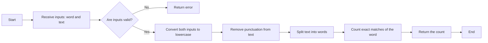

# Documentation
___

Documentation for version: **1.2.0

Welcome to **OpenHosta** documentation :). Here you'll find all the **explanations** you need to understand the library, as well as **usage examples** and advanced **configuration** methods for the most complex tasks. You'll also find explanations of the source code for those interested in **contributing** to this project. Check the [Google Colab](https://colab.research.google.com/drive/1XKrPrhLlYJD-ULTA8WHzIMqTXkb3iIpb?usp=sharing) **test files** to help you take your first steps in discovering OpenHosta.

For this project, we have adopted a [Code of Conduct](CODE_OF_CONDUCT.md) to ensure a respectful and inclusive environment for all contributors. Please take a moment to read it.

___

### Introduction

#### First Step

OpenHosta is a **Python library** designed to facilitate the integration of **LLMs** into the developer's environment, by adding a layer to the Python programming language without distorting it. It is based on the [**PMAC**](PMAC.md) concept, reimagining the **compilation** process in languages. All our functionalities respect the **syntax and paradigm** of this language. 

The choice of LLM is mostly up to you, depending on your configuration level, moreover the vast majority are compatible. By default, OpenAI's **GPT-4o** is chosen. This has been tested by our team during development and **provides** a satisfaying level of functionality. 

Whatever your configuration, make sure you own a **working API key** before proceeding. Keep in mind that each request will incur **costs** which are different depending on the model. You can find prices on distributor websites. Here are the prices for the OpenAI API: https://openai.com/api/pricing/

We've already mentioned a few concepts about **AI** or **computer science**. If some of them are **unclear** to you, please have a look at the *“references”* section, where a series of explanatory links or definitions will be listed to **help** you understand.

Finally, if you like the project and are thinking of contributing, please refer to our [Contribution Guide](CONTRIBUTING.md)

#### Why use OpenHosta?

- **Beyond programming**

OpenHosta enables you to create **complex functions**, including those that were previously **impossible**, by accommodating certain **ambiguities** in human language. It handles language processing related to **common sens** or other challenging parameters that are typically difficult to implement in Python. This tool **simplifies** tasks that would otherwise demand considerable time and expertise, thereby broadening the scope of **possibilities** in Python programming.

- **Python Ecosystem**

OpenHosta integrates **fully** into Python syntax. Our main goal is to push programming to a **higher level**. For example, we send *docstrings*, commonly used in Python, to the **LLMs** context. We also integrate **advanced methods** such as *lambdas* and the compatibility with *Pydantic* and *typing*. 

- **Open-Source**

We are an Open-Source project. We believe this philosophy contributes to the **sustainability** and **independence** of the artificial intelligence sphere. AI is a great **revolution**, so let's bring it **forward** in the best possible way. We count on your **feedback** and **contributions** to keep OpenHosta evolving.

---

##### *Legal Framework*

The use of AI in a production context raises important **legal** issues. It is essential to take these issues into account to ensure the compliance of your **deployment**.

- **Legal Compliance**
For any deployment, it is recommended to verify with an **AI expert** the legal compliance of your use of AI. Indeed, AI is subject to specific **regulations**, particularly in terms of **data protection** and **privacy**. In Europe, the use of AI is governed by the **General Data Protection Regulation** (GDPR) and legislated by the **IA act**. Also, the use of AI in production is subject to specific legal obligations. It is important to take these obligations into account.

- **Security**
The use of AI can also present risks in terms of **cybersecurity**. It is important to take these risks into account to ensure the security of your deployment.
For example **injection attacks** are a major risk when deploying an application using AI. It is important to take measures to protect your application against injection attacks, such as using data validation mechanisms and content filtering.

For more information, please consult the following links:

- [AI Act](https://artificialintelligenceact.eu)
- [GDPR](https://gdpr-info.eu)
- [Prompt Injection Attack](https://www.ibm.com/topics/prompt-injection)

---

Let's **get started**! First here's the **table of contents** to help you navigate through the various sections of the documentation.

### Table of Content

- [Documentation](#documentation)
    - [Introduction](#introduction)
      - [First Step](#first-step)
      - [Why use OpenHosta?](#why-use-openhosta)
        - [*Legal Framework*](#legal-framework)
    - [Table of Content](#table-of-content)
  - [Features](#features)
    - [OpenHosta Example](#openhosta-example)
    - [Get Started](#get-started)
      - [Librairie Import](#librairie-import)
      - [Basic Setup](#basic-setup)
    - ["emulate" Function](#emulate-function)
      - [Supported types \& Pydantic](#supported-types--pydantic)
      - [Integration Details](#integration-details)
    - ["suggest" Function](#suggest-function)
      - [Usage](#usage)
      - [Output Examples](#output-examples)
    - ["predict" Function](#predict-function)
      - [Parameters](#predict-function-parameters)
      - [Additional fonctionalities](#additional-predict-functionalities)
      - [Output setting](#training-output)
    - ["thought" Function](#thought-function)
    - ["example" Function](#example-function)
    - [Advanced configuration](#advanced-configuration)
      - [Introduction](#introduction-1)
      - [Inheriting from the Model Class](#inheriting-from-the-model-class)
      - [Custom LLM Call Function](#custom-llm-call-function)
      - [Custom Response Handling Function](#custom-response-handling-function)
      - [Create a new instance](#create-a-new-instance)
    - [References](#references)

---

## Features

For each part, you'll find functional examples to illustrate the features. If you have any questions, don't hesitate to visit the “Discussion” tab on GitHub.

### OpenHosta Example

```python
from OpenHosta import emulate, config

config.set_default_apiKey("put-your-api-key-here")

def translate(text:str, language:str)->str:
    """
    This function translates the text in the “text” parameter into the language specified in the “language” parameter.
    """
    return emulate()

result = translate("Hello World!", "French")
print(result)
```

### Get Started

Once you've installed the OpenHosta library, you're ready to get started. We'll import the library and then look at the basic configurations.

#### Librairie Import

```python
from OpenHosta import *
```

We recommend this import method, as it gives you all the important and stable features:
  - Emulate function
  - Thought function
  - Example function
  - \_\_suggest\_\_ attributes
  - Configuration tools

But you can also import modules one by one.

```python
from OpenHosta import emulate, config
```

#### Basic Setup

This section focuses on the *config* module.

As previously mentioned, a default model is automatically assigned: GPT-4o. To use it, you first need to enter your API key.

```python
config.set_default_apiKey("put-your-api-key-here")
```

Once you've done that, all OpenHosta's features are ready to use.

If you wish to use another model, you'll need to create an instance of the *Model* class.

```python
my_model = config.Model(
    model="gpt-4o", 
    base_url="https://api.openai.com/v1/chat/completions",
    api_key="put-your-api-key-here"
)
```

Note that some features like `thought` or `__suggest__` specifically use the default model. So if you want to change it, use this.

```python
config.set_default_model(my_model)
```

## `emulate` Function

The *emulate* function is the main feature of OpenHosta. This is the function that allows you to emulate functions with AI, i.e. the instructions will be executed in an LLM and not directly in your computer. Here's how to use it.

Emulate is used inside a function or a class method, after the “return”. What it does is take the function's documentation as a “prompt” to emulate it. The way in which you write the function is therefore crucial to ensure that “emulate” works properly.

Here's what you need to know:
  - **The function prototype** is one of the elements sent to LLM. Its different fields must therefore appear clearly. Give a meaningful and precise name to your function. It's also a good idea to specify the type of arguments and the type of return to reduce the uncertainty related to LLM.
  
```python
def function(a:int, b:dict)->str:
```
  - **The doctring** is the other key element. This is where you describe the behavior of the function. Be precise and concise. Describe the input parameters and the nature of the output, as in a docstring. Feel free to try out lots of things, prompt engineering is not a closed science. :)

```python
my_model = config.Model(
    model="gpt-4o", 
    base_url="https://api.openai.com/v1/chat/completions",
    api_key="put-your-api-key-here"
)

def find_name_age(sentence:str, id:dict)->dict:
    """
    This function find in a text the name and the age of a person.

    Args:
        sentence: The text in which to search for information
        id: The dictionary to fill in with information

    Return:
        A dictionary identical to the one passed in parameter, but filled with the information. 
        If the information is not found, fill with the values with “None”.
    """
    return emulate(model=my_model)
```

Note that, as seen above, you can pass a previously configured model as an emulate parameter.

Be careful, you can put regular instructions in your function and they will be executed. However, `emulate` retrieves all the variables local to the functions and gives them to the LLM as a context.

emulate also accepts two other arguments: `creativity` and `diversity`. It correspond to the "temperature" and "top_p" parameters of LLMs. These values range from 0 to 1 (inclusive). For more information, please refer to the official [OpenAI documentation](https://openai.com/).

#### Supported types & Pydantic

`emulate` support for the **typing** module: You can now use specific return types from the typing module, including [`List`, `Dict`, `Tuple`, `Set`, `FrozenSet`, `Deque`, `Iterable`, `Sequence`, `Mapping`, `Union`, `Optional`, `Literal`].

```python
from OpenHosta import emulate

def analyze_text(text: str) -> Dict[str, List[Tuple[int, str]]]:
    """Analyze text to map each word to a list of tuples containing word length and word."""
    return emulate()

# Example usage
analysis = analyze_text("Hello, World!")

print(analysis)
print(type(analysis))
```

It also includes a verification output that checks and converts the output to the specified type if necessary. Supported types include **Pydantic** models, all types from the **typing** module mentioned above, as well as built-in types such as `dict`, `int`, `float`, `str`, `list`, `set`, `frozenset`, `tuple`, and `bool`.
The `complex` type is not supported. If you need to use complex numbers, please pass them as a `tuple` and manually convert them after processing.

For more information about Typing module, please check the official [Typing documentation](https://docs.python.org/3/library/typing.html)

OpenHosta integrates with Pydantic, a library for data validation and settings management using Python type annotations. This integration allows you to use Pydantic models directly within `emulate`, ensuring data consistency and validation.

Pydantic provides a way to define data models using Python types. It automatically validates and converts input data to match these types, ensuring that your application processes data safely and accurately.

For more information, please read the official [Pydantic documentation](https://docs.pydantic.dev/latest/api/base_model/).

#### Integration Details

OpenHosta supports Pydantic typing by accepting Pydantic models as input of an emulated function. This offers:

- **Type Safety:** Ensures data integrity through Python's type hints.
- **Automatic Validation:** Validates input data against Pydantic models, reducing manual checks.
- **Data Parsing:** Converts input data to specified types, simplifying data handling.

The Pydantic model will be automatically processed by our tools and the LLM to guarantee a stable output.
Let's take the same example, but using this feature:

```python
from pydantic import BaseModel
from OpenHosta import emulate, config

class Person(BaseModel):
    name: str
    age: int

config.set_default_api_key("put-your-api-key-here")

def find_first_name(sentence:str)->Person:
    """
    This function find in a text the name and the age of a person.

    Args:
        sentence: The text in which to search for information

    Return:
        A Pydantic model, but filled with the information. 
        If the information is not found, fill with the values with “None”.
    """
    return emulate()
```

Note that the Pydantic model cannot be defined inside a function, as this will produce an error.

### "suggest" Function

When you use the emulate function, an attribute is automatically attached. This attribute is a function giving you hints on how to improve your prompt, and a diagram visualization tool. This tool uses the default model to operate.

#### Usage

Here's how to use it:

```python
def find_occurence_of_a_word(word :str, text: str) -> int:
    """
    This function takes a word and a text and returns
    the number of times the word appears in the text.
    """
    return emulate()

find_occurence_of_a_word("Hello", "Hello World Hello!")

print(suggest(multpily)) # to have the raw message
print(multiply.diagram) # to have just the diagram

find_occurence_of_a_word.__suggest__(find_occurence_of_a_word) # same
print(find_occurence_of_a_word.advanced)
```

In this example, you can see that after calling the emulated function, we can call `suggest`, which takes as arguments the function object to which it is hooked. After that, we have four new attributes at our disposal:
  - `enhanced prompt`: It's a proposal to improve the function's prompt. 
  - `review`: This is the analysis provided by the AI for its prompt improvement. Can be useful to understand its reasoning.
  - `advanced`: Similar to `enhanced prompt` but adds an iteration. The AI will then try to solve advanced problems according to context or other factors. Especially useful in the most complex cases.
  - `diagram`: Gives a Mermaid diagram showing the stages of AI thinking. Useful if you want to try coding the function yourself.

You can also retrieve the entire LLM response by storing the output of the `suggest` function.

Note that this feature uses the default model.

You can also retrieve the entire LLM response by storing the output of the `suggest` function.

Note that this feature uses the default model.

#### Output Examples

- **Enhanced prompt:**
This function takes two inputs: a word (string) and a text (string). It returns an integer representing the number of times the specified word appears in the given text. The function should be case-insensitive, meaning it should count occurrences of the word regardless of whether it is in uppercase or lowercase. Additionally, the function should handle punctuation properly, ensuring that words followed by punctuation marks are still counted correctly. The function should also include error handling to manage cases where the inputs are not strings or are empty.
- **Review:**
The prompt is clear but lacks specificity in handling edge cases and punctuation. It also doesn't specify how to handle different forms of the word, such as plural or possessive forms. Furthermore, it doesn't mention whether the function should count overlapping occurrences of the word. The prompt could benefit from more detailed requirements to ensure robustness and accuracy.
- **Advanced:**
This function takes two inputs: a word (string) and a text (string). It returns an integer representing the number of times the specified word appears in the given text. The function should be case-insensitive, meaning it should count occurrences of the word regardless of whether it is in uppercase or lowercase. It should handle punctuation properly, ensuring that words followed by punctuation marks are still counted correctly. The function should not count overlapping occurrences of the word. Additionally, the function should include error handling to manage cases where the inputs are not strings or are empty. It should also handle different forms of the word, such as plural or possessive forms, by considering only exact matches of the word.`
- **Mermaid diagramm**



---

## `predict` Function

The `predict` function is the second major feature of OpenHosta, designed to enable the dynamic creation of models for specific functions. While it shares similarities with the `emulate` function, instead of making API calls to a large language model (LLM), `predict` generates an internal model—currently supporting only linear regression.

### How `predict` Works

The `predict` function allows users to train a model automatically by providing a set of training examples. It simplifies model-building by handling the training process directly within a Python function. 

At this time, `predict` has a few **limitations** to be aware of:

- **Supported Input Types**: Only `int` and `float` types are allowed as inputs.
- **Return Type**: The function returns output as a `float`.
- **Model Type**: Currently, the function builds a simple linear regression model with a single output.
- **Training Examples**: You must provide at least one example for the model to be trained correctly.

### Limitations and Known Issues

- Since `predict` is still in its Release Candidate (RC) phase, some instability and bugs might occur. 
- If you encounter any issues, please help improve the functionality by reporting them :)
---


- *Below is a practical example demonstrating how to use `predict` to build a model that estimates a person's chance of dying based on their age*:

```python
from OpenHosta import predict, example

def find_chance_of_die(age: float) -> float:
    """
    This function predicts the chance of dying in a percentage value from 0 to 1, 
    based on the age (with the baseline year starting at 1900).
    """
    # We forced some interpolation not real data
    example(age=124.0, hosta_out=0.99)
    example(age=100.5, hosta_out=0.20)
    example(age=55.0,  hosta_out=0.60)
    example(age=45.0,  hosta_out=0.10)
    example(age=24.8,  hosta_out=0.20)
    example(age=8.0,   hosta_out=0.01)
    return predict()

x = find_chance_of_die(124.0)
print(x)
```
For `example` documentation, please go to this [link](#example-function)

### `predict` Function Parameters

The `predict` function includes several parameters that allow you to fine-tune the model's behavior. Below is a list of these parameters:

- **`epochs` (int)**: 
   Defines how many times the model iterates over the training set. Increasing the number of epochs may lead to better model convergence at the cost of longer training times. The default value is 2 times the dataset size, calculated based on the batch size.
   
- **`complexity` (int)**: 
   Sets the level of complexity for the model, which influences the number of weights based on the length of the input. The default value is `5`.
   
- **`normalization` (bool)**: 
   Enables or disables data normalization. When set to `True`, the input data will be normalized based on the `norm_min` and `norm_max` values. The default is `False`.
   
- **`norm_min` (float)**: 
   Defines the minimum value for data normalization. This value helps scale input data to a normalized range. The default is `0.1` for value that are different than 0.
   
- **`norm_max` (float)**: 
   Specifies the maximum value for data normalization. This value sets the upper bound for the normalized range. The default is `1.0`.
   
- **`verbose` (bool)**: 
   Enables or disables verbose output during training. When set to `True`, detailed progress information, including loss values, will be displayed. The default is `False`.
   
- **`batch_size` (int)**: 
   Defines the number of training examples to be used in one iteration. By default, it is set to `5%` of the dataset size or `len(dataset)` if the dataset size is too small for 5%.

---

### Additional `predict` Functionalities

The `predict` function also comes with several methods designed to enhance the user experience when building and refining an *Hosta model*. Below are the key methods you can use to interact with and further train your models:

#### 1. `retrain`

The `retrain` method allows you to retrain the model from scratch. It takes several directive parameters:

- **`epochs`**: Specifies the number of training epochs.
- **`get_loss`**: Defines a target loss for the model to reach during training.
- **`verbose`**: Displays detailed training information (if set to `True`).

#### Example:
```python 
find_chance_of_die.retrain(epochs=150, get_loss=0.001, verbose=True)
```

#### 2. `continue_train`

The `continue_train` method allows you to continue training the model using the current weights, rather than starting from scratch. It also accepts directive parameters:

- **`epochs`**: Specifies how many additional epochs you want to train the model for.
- **`get_loss`**: Defines a target loss value for the model to reach during continued training.
- **`verbose`**: Displays training progress information (if set to `True`).

#### Example:
```python 
find_chance_of_die.continue_train(epochs=150, get_loss=0.001, verbose=True)
```

#### 3. `emulate`

The `emulate` function makes an API call to a Large Language Model (LLM) to assist in answering predictions made by the `predict` function. For more details, check the documentation of [predict](#predict-function). 

#### Example:
```python
find_chance_of_die.emulate(124.0)
```

--- 


### TrainingSet Management

The `TrainingSet` feature offers easy tools for managing training datasets in `hosta_injected` functions:

- **`.visualize`**: View the current dataset and its examples.
- **`.add`**: Add new examples to the dataset.

#### Example:

You can generate and add data to your training set like so:

```python

def cos_plus_sin_generator():
    for i in range(0, 10):
        for j in range(0, 10):
            cos_value = math.cos(i) ** i
            sin_value = math.sin(j) ** j
            training_maths.add(cos=i, sin=j, hosta_out=cos_value + sin_value)
            # Add data to the training set

cos_plus_sin_generator()
training_maths.visualize()  # Visualize the dataset
```

This allows you to both populate and inspect your training data with ease.

---

### Training Output of predict

When training the model using `predict`, a corresponding folder will be created under `__hostachache__`. This folder will contain:
- `config.json`: Configuration file describing model parameters like structure, training data, etc.
- `model.pth`: The serialized weights of the trained model.
- `normalization.json`: Values for data normalization to ensure consistent input/output scaling.

These files are used to manage the model, its saved state, and how incoming data will be normalized before being processed.

## `thought` Function

**Lambda** functions in Python provide a way to create small, anonymous functions. These are defined using the lambda keyword and can have any number of input parameters but only a single expression.

**Key Characteristics**
  - **Anonymous**: Lambda functions do not require a name, making them suitable for short-lived operations.
  - **Concise Syntax**: Defined in a single line using the syntax lambda arguments: expression.
  - **Single Expression**: Can only contain a single expression, which is evaluated and returned.
  
For more information, please check https://python-reference.readthedocs.io/en/latest/docs/operators/lambda.html

In an aim to integrate with Python syntax, we've developed the `thought` function. It replicates the same behavior as lambda.

Here's how it works:

```python
from OpenHosta import thought

x = thought("Is it a masculine name")
print(x("John"))  # True

result = thought("Multiply by two")(2)
print(result)   # 4
```

In the example above, we can see two distinct ways of using `thought`. In the first example, you can store a lambda function in a variable and then use it. You can also call it directly by enclosing the arguments behind it in brackets. `thought` accepts multiple arguments and all types native to python. However, the content of the first bracket is always a string.

The `thought` function has an initial pre-compilation stage where it predicts the type of the return value by making an initial call to an LLM. Execution time can therefore be increased.
You can retrieve the predicted return type with the `_return_type` attribute attached to the object:

```python
from OpenHosta import thought

x = thought("Adds all integers")
ret = x(2 ,3 ,6)
print(x._return_type) # int
```

**Note** : ***this feature uses the default model.***

## `example` Function

The "example" function is designed to enhance the context of a function for a LLM by adding examples to it. This functionality is encapsulated in the `example` function.

**Key Characteristics**

- **Versatile**: The "example" function can be used both inside and outside a function to specify examples.
- **Save**: The "example" function provides a tool called `save_examples` that can store all the examples added to a specified function in a ***JSONL*** file.
- **Load**: The function also offers a tool called `load_training_example` to load a file into the context of the function especially for `predict function`. 

***Notes : `load_examples` can load `csv`, `json` or `jsonl` file for the moment*** 

Here's how it works: 

```python
from OpenHosta import emulate, example

def translate(text:str, language:str)->str:
    """
    This function translates the text in the “text” parameter into the language specified in the “language” parameter.
    """
    example("Bonjour Monde !", "portuguese", hosta_out="ola mundo" )
    return emulate()


example(text="Hello World !", language="japanese", hosta_out="こんにちは世界!", hosta_func=translate)

print(translate("Hello World !", "French"))
```

The `example` function will verify the correlation between the specified input and the parameters of the function. The output should be specified only in the *hosta_out* parameter. If the example are used outside a function, please use the *hosta_func* parameter to specify a function.

Now here's how works `save_examples` and `load_training_example`

```python
from OpenHosta import save_examples, load_training_example

save_examples(hosta_func=translate, hosta_path="translate_func_example")

#######

def another_translate(text:str, language:str)->str:
    """
    This function translates the text in the “text” parameter into the language specified in the “language” parameter.
    """
    return emulate()

load_training_example(hosta_path="translate_func_example.jsonl", hosta_func=another_translate)
```

output of the `translate_func_example.jsonl`

```JsonL
{"text": "Hello World !", "language": "japanese", "hosta_out": "こんにちは世界!"}
{"text": "Bonjour Monde !", "language": "portuguese", "hosta_out": "ola mundo"}
```


**Notes**: *All examples provided for a function are stored in a directory at the root of your environment. You can see it as* ***\_\_hostacache__***.


### Advanced configuration


#### Introduction

This section explains how to customize the program to make its own LLM call and response handling functions. This can be useful if you need a specific functionality that is not provided by the standard library, or to enable compatibility with a specific LLM.

#### Inheriting from the Model Class

The first step is to inherit from the Model class to create your own configuration class. The Model class provides a base for the library's configuration, including connection settings to the LLM and response handling functions.

```python
from OpenHosta import Model

class MyModel(Model):
    # Your code here
```

In the example above, we have created a new class `MyModel` that inherits from the Model class. This means that `MyModel` has access to all the methods and attributes of the Model class. You can now add your own functions to this class to customize the OpenHosta's configuration.
You can also override an existing function to modify its behavior. It is important to keep input/output components identical in order to avoid errors when interacting with calling functions.

#### Custom LLM Call Function

To create your own LLM call function, you need to override the `api_call` method of the Model class. This method is called every time the library needs to communicate with the LLM.

```python
from OpenHosta import Model

class MyModel(Model):
    def api_call(self, sys_prompt, user_prompt, creativity, diversity):
        # Your code here
        # Call the LLM and return the response
        return response
```

In the example above, we have overridden the "api_call" method of the Model class to create our own LLM call function.
The "api_call" method takes four arguments:

- **sys_prompt**: a string that specifies the system prompt to be sent to the LLM. It's all the basic instructions to give context to the LLM. It is not function-dependent, but feature-dependent.. System prompts provided by OpenHosta are present in the “prompt.json” file.
- **user_prompt**: a string that specifies the user prompt to be sent to the LLM. It contains all the information relating to the emulated function. They are placed side by side, with sentences to separate each piece of information. This section is therefore unique for each case. 
- **creativity**: a float that specifies the creativity level of the LLM's response.
- **diversity**: a float that specifies the diversity level of the LLM's response.

The "api_call" method returns a response object that contains the LLM's response to the user prompt.

#### Custom Response Handling Function

To create your own response handling function, you need to override the "request_handler" method of the Model class. This method is called every time the library receives a response from the LLM.

```python
from OpenHosta import Model

class MyModel(Model):
    def request_handler(self, response, return_type, return_caller):
        # Your code here
        # Process the LLM response and return the result
        return result
```

In the example above, we have overridden the `request_handler` method of the Model class to create our own response handling function. 
The "request_handler" method takes three arguments:

- **response**: the response object returned by the LLM.
- **return_caller**: the type of the return value. For an “int” return type, it would be as follows
  ```<class :'int'>```
- **return_type**: a JSON describing the type of the return value. This JSON is mainly used for more complex return types such as Pydantic models or classes. For an “int” return type, the JSON would be as follows:
  ```{'properties': {'return_hosta_type': {'title': 'Return Hosta Type', 'type': 'integer'}}, 'required': ['return_hosta_type'], 'title': 'Hosta_return_shema', 'type': 'object'}```

The "request_handler" method returns the processed return value. This is the value returned by the emulated function.

#### Create a new instance

You can now create an instance of the class you've just created and use it in all OpenHosta's features.

```python
from OpenHosta import config, Model, emulate, thought

class MyModel(Model):

    def api_call(self, sys_prompt, user_prompt, creativity, diversity):
        # Your code here
        # Call the LLM and return the response
        return response

    def request_handler(self, response, return_type, return_caller):
        # Your code here
        # Process the LLM response and return the result
        return l_ret

new_model = MyModel(
    model="model-name"
    base_url="base-url"
    api_key="put-your-api-key-here"
)

def capitalize(a:str)->str:
    """
    This function capitalize a sentence in parameter.
    """
    return emulate(model=new_model)

print(capitalize("hello world!"))

config.set_default_model(new_model)

x = thought("Translate in german")
ret = x("Hello World")
print(ret)
```

---

### References

- **LLM**: https://en.wikipedia.org/wiki/Large_language_model
- **GPT-4o**: https://en.wikipedia.org/wiki/GPT-4o
- **AI**: https://en.wikipedia.org/wiki/Artificial_intelligence
- **NLP**: https://en.wikipedia.org/wiki/Natural_language_processing

---

We hope you find all the information you need. We are proud to present the first version of this project. 
The OpenHosta team. :)

---

