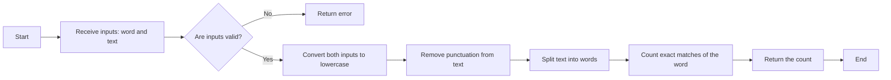

# Documentation
___

**You will find above a short desciption with examples to understand how OpenHosta works.Hope you will like it ! :)**

*if you want to test it move the `example.ipynb` file in `src`*

#### Import the emulator

```python
from OpenHosta import emulator

llm = emulator()
```

#### Let's create a new function. In fact, you need to place the decorator `llm.emulate` above the function. A decorator is used here to take the function as a parameter.

Your function should be prototyped like this

```python
@llm.emulate
def AI_find_occurence_of_a_word(word :str, text: str) -> int:
    """
    This function takes a word and a text and returns
    the number of times the word appears in the text.
    """
    pass

AI_find_occurence_of_a_word("hello", "hello world hello") # 2
```

output :
```bash
2
```
___

#### If you want to improve your prompt, see what's the AI understand and see a vizualizer of the reasonning please use the decorator `llm.enhance`
Your function should be prototiped like this : 

```python
@llm.enhance
def AI_find_occurence_of_a_word_enhance(word :str, text: str) -> int:
    """
    This function takes a word and a text and returns
    the number of times the word appears in the text.
    """
    pass

AI_find_occurence_of_a_word_enhance("hello", "hello world hello")
```

A directory `.openhosta` will appears and he will contain :

**A mermaid vizualizer**


**A understanding of the input prompt and an possible update version for more precision (*that you need to change manually if you agree this*).**
___
- **Enhanced prompt:**
This function takes two inputs: a word (string) and a text (string). It returns an integer representing the number of times the specified word appears in the given text. The function should be case-insensitive, meaning it should count occurrences of the word regardless of whether it is in uppercase or lowercase. Additionally, the function should handle punctuation properly, ensuring that words followed by punctuation marks are still counted correctly. The function should also include error handling to manage cases where the inputs are not strings or are empty.
- **How to improve your prompt:**
The prompt is clear but lacks specificity in handling edge cases and punctuation. It also doesn't specify how to handle different forms of the word, such as plural or possessive forms. Furthermore, it doesn't mention whether the function should count overlapping occurrences of the word. The prompt could benefit from more detailed requirements to ensure robustness and accuracy.
- **Improvemed prompt suggestion:**
This function takes two inputs: a word (string) and a text (string). It returns an integer representing the number of times the specified word appears in the given text. The function should be case-insensitive, meaning it should count occurrences of the word regardless of whether it is in uppercase or lowercase. It should handle punctuation properly, ensuring that words followed by punctuation marks are still counted correctly. The function should not count overlapping occurrences of the word. Additionally, the function should include error handling to manage cases where the inputs are not strings or are empty. It should also handle different forms of the word, such as plural or possessive forms, by considering only exact matches of the word.`
___

## How to use OpenHosta ?

This is a brief explanation, if you want more details, please refer to the complete [documentation](Documentation/Docs.md) and and [examples](Documentation/example.ipynb) available. 

### Usage

Make sure to import the library.

```python
import OpenHosta
```

Here is a simple usage example:

```python
llm = OpenHosta.emulator()    # You need to put your API key and the model as parameters

@llm.emulate                  # or "@llm.enhance"
def example(a:int, b:int)->int:  # Put your prompt in the docstrings
   """
   This is a very precise example prompt.  
   """
   pass                       # The function therefore contains no instructions

example(4, 2)                 # Call the function to activate the decorator      
```

### Features

```python
llm = emulator()
```

- `llm` contains three main decorators. Decorators in Python are functions that modify the behavior of other functions or methods, allowing for additional functionalities in a modular way:
  - `@llm.emulate`: Decorates a function to emulate its execution by an AI. You can choose the model using your API key.
  - `@llm.enhance`: Decorates a function and generates a Mermaid diagram to visualize and understand the model's reasoning, as well as a markdown help file to improve the function's prompt. Everything is stored in the `.openhosta` directory at the root of the working directory.

### Configuration

The `emulator` class can have four parameters:
   - `model`: LLM model to which the program will send its requests
   - `creativity` & `diversity`: Correspond to the "temperature" and "top_p" parameters of LLMs. These values range from 0 to 1 (inclusive). For more information, please refer to the official [OpenAI documentation](https://openai.com/)
   - `api_key`: Your own api-key to communicate with the llm

Example:
```python
llm = OpenHosta.emulator(
   model="gpt-4o", 
   api_key="This_is_my_api_key",
   creativity=0.7,
   diversity=0.5
)
```