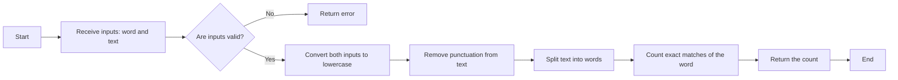

# Documentation
___

Documentation for version: **1.0**

Welcome to **OpenHosta** documentation :). Here you'll find all the **explanations** you need to understand the library, as well as **usage examples** and advanced **configuration** methods for the most complex tasks. You'll also find explanations of the source code for those interested in **contributing** to this project. Check the [Google Colab](https://colab.research.google.com/drive/1XKrPrhLlYJD-ULTA8WHzIMqTXkb3iIpb?usp=sharing) **test files** to help you take your first steps in discovering OpenHosta.

For this project, we have adopted a [Code of Conduct](CODE_OF_CONDUCT.md) to ensure a respectful and inclusive environment for all contributors. Please take a moment to read it.

___

### Introduction

#### First Step

OpenHosta is a **Python library** designed to facilitate the integration of **LLMs** into the developer's environment, by adding a layer to the Python programming language without distorting it. It is based on the **PMAC** concept, reimagining the **compilation** process in “Just-In-Time” languages. All our functionalities respect the **syntax and paradigm** of this language. 

The choice of LLM is mostly up to you, depending on your configuration level, moreover the vast majority are compatible. By default, OpenAI's **GPT-4o** is chosen. This has been tested by our team during development and **provides** a satisfaying level of functionality. 

Whatever your configuration, make sure you own a **working API key** before proceeding. Keep in mind that each request will incur **costs** which are different depending on the model. You can find prices on distributor websites. Here are the prices for the OpenAI API: https://openai.com/api/pricing/

We've already mentioned a few concepts about **AI** or **computer science**. If some of them are **unclear** to you, please have a look at the *“references”* section, where a series of explanatory links or definitions will be listed to **help** you understand.

Finally, if you like the project and are thinking of contributing, please refer to our [Contribution Guide](CONTRIBUTING.md)

#### Why use OpenHosta?

- **Beyond programming**

OpenHosta enables you to create **complex functions**, including those that were previously **impossible**, by accommodating certain **ambiguities** in human language. It handles language processing related to **common sens** or other challenging parameters that are typically difficult to implement in Python. This tool **simplifies** tasks that would otherwise demand considerable time and expertise, thereby broadening the scope of **possibilities** in Python programming.

- **Python Ecosystem**

OpenHosta integrates **fully** into Python syntax. Our main goal is to push programming to a **higher level**. For example, we send *docstrings*, commonly used in Python, to the **LLMs** context. We also integrate **advanced methods** such as *lambdas* and the compatibility with *Pydantic* typing. 

- **Open-Source**

We are an Open-Source project. We believe this philosophy contributes to the **sustainability** and **independence** of the artificial intelligence sphere. AI is a great **revolution**, so let's bring it **forward** in the best possible way. We count on your **feedback** and **contributions** to keep OpenHosta evolving.

---

Let's **get started**! First here's the **table of contents** to help you navigate through the various sections of the documentation.

### Table of Content

- [Documentation](#documentation)
    - [Introduction](#introduction)
      - [First Step](#first-step)
      - [Why use OpenHosta?](#why-use-openhosta)
    - [Table of Content](#table-of-content)
  - [Features](#features)
    - [OpenHosta Example](#openhosta-example)
    - [Get Started](#get-started)
      - [Librairie Import](#librairie-import)
      - [Basic Setup](#basic-setup)
    - ["emulate" Function](#emulate-function)
    - [Pydantic Return](#pydantic-return)
      - [Integration Details](#integration-details)
    - ["suggest" Attributs](#suggest-attributs)
      - [Usage](#usage)
      - [Output Examples](#output-examples)
    - ["thought"](#thought)
    - [References](#references)

---

## Features

For each part, you'll find functional examples to illustrate the features. If you have any questions, don't hesitate to visit the “Discussion” tab on GitHub.

### OpenHosta Example

```python
from OpenHosta import emulate, config

config.set_default_apiKey("put-your-api-key-here")

def translate(text:str, language:str)->str:
    """
    This function translates the text in the “text” parameter into the language specified in the “language” parameter.
    """
    return emulate()

result = translate("Hello World!", "French")
print(result)
```

### Get Started

Once you've installed the OpenHosta library, you're ready to get started. We'll import the library and then look at the basic configurations.

#### Librairie Import

```python
from OpenHosta import *
```

We recommend this import method, as it gives you all the important and stable features:
  - Emulate function
  - Thought function 
  - \_\_suggest\_\_ attributes
  - Configuration tools

But you can also import modules one by one.

```python
from OpenHosta import emulate, config
```

#### Basic Setup

This section focuses on the *config* module.

As previously mentioned, a default model is automatically assigned: GPT-4o. To use it, you first need to enter your API key.

```python
config.set_default_apiKey("put-your-api-key-here")
```

Once you've done that, all OpenHosta's features are ready to use.

If you wish to use another model, you'll need to create an instance of the *Model* class.

```python
my_model = config.Model(
    model="gpt-4o", 
    base_url="https://api.openai.com/v1/chat/completions",
    api_key="put-your-api-key-here"
)
```

Note that some features like `thought` or `__suggest__` specifically use the default model. So if you want to change it, use this.

```python
config.set_default_model(my_model)
```

### "emulate" Function

The *emulate* function is the main feature of OpenHosta. This is the function that allows you to emulate functions with AI, i.e. the instructions will be executed in an LLM and not directly in your computer. Here's how to use it.

Emulate is used inside a function, after the “return”. What it does is take the function's documentation as a “prompt” to emulate it. The way in which you write the function is therefore crucial to ensure that “emulate” works properly.

Here's what you need to know:
  - **The function prototype** is one of the elements sent to LLM. Its different fields must therefore appear clearly. Give a meaningful and precise name to your function. It's also a good idea to specify the type of arguments and the type of return to reduce the uncertainty related to LLMs. 
```python
def function(a:int, b:dict)->str:
```
  - **The doctring** is the other key element. This is where you describe the behavior of the function. Be precise and concise. Describe the input parameters and the nature of the output, as in a docstring. Feel free to try out lots of things, prompt engineering is not a closed science. :)

```python
my_model = config.Model(
    model="gpt-4o", 
    base_url="https://api.openai.com/v1/chat/completions",
    api_key="put-your-api-key-here"
)

def find_name_age(sentence:str, id:dict)->dict:
    """
    This function find in a text the name and the age of a personn.

    Args:
        sentence: The text in which to search for information
        id: The dictionary to fill in with information

    Return:
        A dictionary identical to the one passed in parameter, but filled with the information. 
        If the information is not found, fill with the values with “None”.
    """
    return emulate(model=my_model)
```

Note that, as seen above, you can pass a previously configured model as an emulate parameter.

Be careful, you can put regular instructions in your function and they will be executed. However, emulate doesn't take into account any changes to internal variables.

emulate also accepts two other arguments: `creativity` and `diversity`. It correspond to the "temperature" and "top_p" parameters of LLMs. These values range from 0 to 1 (inclusive). For more information, please refer to the official [OpenAI documentation](https://openai.com/).

### Pydantic Return 

OpenHosta integrates with Pydantic, a library for data validation and settings management using Python type annotations. This integration allows you to use Pydantic models directly within `emulate`, ensuring data consistency and validation.

Pydantic provides a way to define data models using Python types. It automatically validates and converts input data to match these types, ensuring that your application processes data safely and accurately. For more information, please read the official [Pydantic documentation](https://docs.pydantic.dev/latest/api/base_model/).

#### Integration Details

OpenHosta supports Pydantic typing by accepting Pydantic models as input of an emulated function. This offers:

- **Type Safety:** Ensures data integrity through Python's type hints.
- **Automatic Validation:** Validates input data against Pydantic models, reducing manual checks.
- **Data Parsing:** Converts input data to specified types, simplifying data handling.

The Pydantic model will be automatically processed by our tools and the LLM to guarantee a stable output.
Let's take the same example, but using this feature:

```python
from pydantic import BaseModel
from OpenHosta import emulate, config

class Personn(BaseModel):
    name: str
    age: int

config.set_default_api_key("put-your-api-key-here")

def find_first_name(sentence:str)->Personn:
    """
    This function find in a text the name and the age of a personn.

    Args:
        sentence: The text in which to search for information

    Return:
        A Pydantic model, but filled with the information. 
        If the information is not found, fill with the values with “None”.
    """
    return emulate()
```

### "suggest" Attributs

When you use the emulate function, an attribute is automatically attached. This attribute is a function giving you hints on how to improve your prompt, and a diagram visualization tool. This tool uses the default model to operate.

#### Usage

Here's how to use it:

```python
def find_occurence_of_a_word(word :str, text: str) -> int:
    """
    This function takes a word and a text and returns
    the number of times the word appears in the text.
    """
    return emulate()

find_occurence_of_a_word("Hello", "Hello World Hello!")

find_occurence_of_a_word.__suggest__(find_occurence_of_a_word)
print(find_occurence_of_a_word.advanced)
```

In this example, you can see that after calling the emulated function, we can call `suggest`, which takes as arguments the function object to which it is hooked. After that, we have four new attributes at our disposal:
  - `enhanced prompt`: It's a proposal to improve the function's prompt. 
  - `review`: This is the analysis provided by the AI for its prompt improvement. Can be useful to understand its reasoning.
  - `advanced`: Similar to `enhanced prompt` but adds an iteration. The AI will then try to solve advanced problems according to context or other factors. Especially useful in the most complex cases.
  - `diagramm`: Gives a Mermaid diagram showing the stages of AI thinking. Useful if you want to try coding the function yourself.

#### Output Examples

- **Enhanced prompt:**
This function takes two inputs: a word (string) and a text (string). It returns an integer representing the number of times the specified word appears in the given text. The function should be case-insensitive, meaning it should count occurrences of the word regardless of whether it is in uppercase or lowercase. Additionally, the function should handle punctuation properly, ensuring that words followed by punctuation marks are still counted correctly. The function should also include error handling to manage cases where the inputs are not strings or are empty.
- **Review:**
The prompt is clear but lacks specificity in handling edge cases and punctuation. It also doesn't specify how to handle different forms of the word, such as plural or possessive forms. Furthermore, it doesn't mention whether the function should count overlapping occurrences of the word. The prompt could benefit from more detailed requirements to ensure robustness and accuracy.
- **Advanced:**
This function takes two inputs: a word (string) and a text (string). It returns an integer representing the number of times the specified word appears in the given text. The function should be case-insensitive, meaning it should count occurrences of the word regardless of whether it is in uppercase or lowercase. It should handle punctuation properly, ensuring that words followed by punctuation marks are still counted correctly. The function should not count overlapping occurrences of the word. Additionally, the function should include error handling to manage cases where the inputs are not strings or are empty. It should also handle different forms of the word, such as plural or possessive forms, by considering only exact matches of the word.`
- **Mermaid diagramm**


### "thought"

**Lambda** functions in Python provide a way to create small, anonymous functions. These are defined using the lambda keyword and can have any number of input parameters but only a single expression.

**Key Characteristics**
  - **Anonymous**: Lambda functions do not require a name, making them suitable for short-lived operations.
  - **Concise Syntax**: Defined in a single line using the syntax lambda arguments: expression.
  - **Single Expression**: Can only contain a single expression, which is evaluated and returned.
  
For more information, please check https://python-reference.readthedocs.io/en/latest/docs/operators/lambda.html

In an aim to integrate with Python syntax, we've developed the `thought` function. It replicates the same behavior as lambda.

Here's how it works:

```python
from OpenHosta import thought

x = thought("Is it a masculine name")
print(x("John"))  # True

result = thought("Multiply by two")(2)
print(result)   # 4
```

Note that this feature uses the default model.

---

### References

- **LLM**: https://en.wikipedia.org/wiki/Large_language_model
- **GPT-4o**: https://en.wikipedia.org/wiki/GPT-4o
- **AI**: https://en.wikipedia.org/wiki/Artificial_intelligence
- **NLP**: https://en.wikipedia.org/wiki/Natural_language_processing

---

We hope you find all the information you need. We are proud to present the first version of this project. 
The OpenHosta team. :)

---

